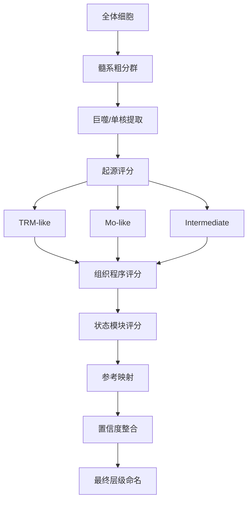

# 针对巨噬细胞的单细胞注释可行策略分析报告

## 执行摘要

本报告提出一套**面向实验室可实施**的巨噬细胞单细胞注释策略：先做**髓系粗分群**，再按**起源模块**区分“血液来源单核细胞衍生巨噬细胞”与“组织驻留样巨噬细胞”，随后再按**状态模块**细分为炎症样、抗原呈递样、脂代谢/重塑样、干扰素样、增殖样等功能程序，最后才在具体癌种内做二次命名。这样做的核心原因是：公开数据反复显示，巨噬细胞在不同实体瘤中存在明显的连续谱，而不是简单落在“M1/M2”两个端点；同时，不同研究的数据来源、平台和肿瘤部位差异很大，**几乎不存在可跨平台直接照搬的统一阈值**。因此，可操作的最佳实践不是“单一标记基因判定”，而是“**层级框架 + 基因模块评分 + 参考映射 + 人工复核**”的组合策略。citeturn25view1turn25view2turn26view0turn30view0turn30view1turn31view0turn25view0

参考用户提供的 T 细胞分类文章思路，本报告在组织方式上借鉴三条原则：**先在方法中写清判据、提供术语字典、并采用模块化命名而不是过度本体化命名**。对巨噬细胞而言，最稳妥的命名应同时编码“细胞类别、起源倾向、组织程序、活化/功能状态、肿瘤情境”，例如 `Mac_TRM_microglia_P2RY12`、`Mac_Mo_FCN1_IL1B`、`Mac_TAM_SPP1_TREM2`。这比直接把簇命名成“免疫抑制型巨噬细胞”更透明，也更有利于跨队列复现。

在证据层面，本报告优先依赖**原始研究的公开数据集页面**与**官方数据库**。用于检索和验证的高优先级资源包括 GEO、Human Cell Atlas、PanglaoDB 以及中文医学检索系统 SinoMed 和万方。GEO 明确是公共功能基因组仓库；HCA 的目标是构建全人类细胞参考图谱；PanglaoDB 提供统一整合的单细胞数据和细胞标记；SinoMed 与万方则适合补充中文文献与国内队列信息。citeturn3view0turn4view0turn4view1turn4view2turn5view1

面向具体肿瘤，公开单细胞研究已经足以支持一个**“先泛癌、后癌种”的注释工作流**。本文重点讨论胶质母细胞瘤和乳腺癌，并纳入非小细胞肺癌、结直肠癌、肝细胞癌、胰腺导管腺癌和高级别浆液性卵巢癌作为常见实体瘤扩展场景。跨癌种重复出现的巨噬细胞轴主要包括：**FCN1/S100A8/S100A9 单核细胞进入轴、C1QC/FOLR2/TIMD4 驻留/吞噬轴、SPP1/TREM2/APOE/GPNMB 重塑与脂代谢轴，以及 IFN 与增殖模块**；但这些轴在不同癌种中的占比、空间位置和临床关联并不一致，因此注释框架必须显式保留“癌种限定”和“不确定/过渡态”标签。citeturn25view1turn25view2turn26view0turn30view0turn30view1turn31view0

## 检索策略与证据优先级

本课题建议采用**“三层检索”**。第一层是原始研究和官方数据仓库，用于获得可复现实验对象、样本组成、平台信息和作者原始命名；第二层是公共单细胞参考图谱和标记数据库，用于形成候选基因模块；第三层是中文数据库，用于补充国内病例队列、中文综述、病理背景和本土实践。GEO 明确提供公共功能基因组数据与下载工具；Human Cell Atlas 以建立全人类细胞参考图谱为使命；PanglaoDB 整合多研究、提供统一框架与细胞标记浏览；SinoMed 是中外文整合的生物医学文献服务系统；万方提供期刊、学位论文、会议论文与科学数据等多类学术资源。citeturn3view0turn4view0turn4view1turn4view2turn5view1

在检索词设计上，建议把“细胞类型词、起源词、状态词、癌种词、技术词”拆开组合，而不是一次性用长句。这样做更容易在 PubMed、GEO、SinoMed 和万方中获得可控结果，也便于将英文文献与中文文献统一映射到同一注释问题。

| 检索层级 | 目的 | 推荐检索词 |
|---|---|---|
| 原始研究 | 找到可直接复现的 scRNA/snRNA 队列 | `macrophage single-cell annotation tumor`, `tumor-associated macrophage scRNA-seq`, `glioblastoma macrophage single-cell`, `breast cancer macrophage CITE-seq`, `monocyte-derived macrophage tissue-resident macrophage single cell` |
| 起源判定 | 找到单核来源与驻留来源线索 | `monocyte-derived macrophage tissue-resident macrophage ontogeny`, `microglia monocyte-derived macrophage glioblastoma`, `FOLR2 TIMD4 LYVE1 resident macrophage`, `FCN1 S100A8 S100A9 macrophage tumor` |
| 功能状态 | 找到状态模块 | `SPP1 TREM2 macrophage tumor`, `IFN macrophage single-cell`, `antigen presenting macrophage HLA-DRA single-cell`, `cycling macrophage MKI67 tumor` |
| 中文文献 | 补充国内实践与术语 | `巨噬细胞 单细胞 注释`, `单核细胞来源 巨噬细胞 组织驻留 巨噬细胞`, `胶质母细胞瘤 巨噬细胞 单细胞`, `乳腺癌 巨噬细胞 单细胞`, `肿瘤相关巨噬细胞 标志基因` |
| 数据集定位 | 找验证队列 | `GSE macrophage tumor single-cell`, `GEO glioblastoma scRNA macrophage`, `GEO breast cancer atlas single-cell`, `GEO colorectal myeloid single-cell` |

实际检索执行时，建议把来源优先级写进方法学 SOP：**原始研究 > 官方数据库 > 中文医学数据库 > 高质量综述**。如果原始研究与综述对某一标记解释不一致，应优先回到作者原始数据集或其 GEO 摘要说明，再决定是否把该标记纳入注释规则。GEO、HCA、PanglaoDB、SinoMed 和万方都适合承担这一“证据回溯”的角色。citeturn3view0turn4view0turn4view1turn4view2turn5view1

## 起源导向的巨噬细胞注释依据

巨噬细胞注释最容易出错的地方，是把“**起源**”和“**状态**”混为一谈。一个细胞可以呈现炎症、脂代谢、干扰素、吞噬或抗原呈递状态，但这些状态并不自动等价于它来自循环单核细胞还是来自组织驻留谱系。发育生物学与近年的图谱研究共同支持：**部分组织中的驻留巨噬细胞在胚胎期建立并可成年自我维持，而疾病组织中大量新进入的巨噬细胞通常来自循环单核细胞；在肿瘤中，这两种来源往往共存，而且会随肿瘤阶段和空间位点变化。**这一点在脑内微胶质/非实质边界巨噬细胞的不同发育程序，以及肺肿瘤中“早期驻留、后期单核来源增多”的描述中尤其有代表性。citeturn16search1turn17search2turn23search5

因此，单细胞注释不应追求“绝对起源判定”，而应采用**起源倾向**或**起源概率**。在缺乏谱系追踪、体细胞突变谱或移植嵌合证据时，最稳妥的表述是：`TRM-like`、`Mo-derived-like`、`transition/intermediate`。这类命名在肿瘤样本中特别重要，因为肿瘤环境会让来源不同的巨噬细胞在转录层面部分收敛，尤其会共同上调 APOE、SPP1、TREM2、GPNMB、LGALS3 等重塑或脂代谢相关程序。

下表给出一套**工程化的注释基因面板**。它不是教科书式“唯一正确答案”，而是面向单细胞注释的**工作定义**。建议把它当作**模块评分面板**使用，而不是当作“单基因一票否决”的规则。

| 类别 | 建议核心基因面板 | 解释与适用说明 |
|---|---|---|
| 髓系/巨噬细胞粗门控 | `LST1, TYMP, FCER1G, C1QA, C1QB, C1QC, CTSB, CTSD, AIF1` | 用于先从全体细胞中提取巨噬/单核-髓系群；应同时排除 `EPCAM/KRT*`、`COL1A1/DCN`、`CD3D/E`、`MS4A1/CD79A`、`NKG7/GNLY`、`TPSAB1/KIT` 等非髓系信号。该面板是基于参考图谱与标记数据库整理的工作集合。citeturn4view0turn4view1 |
| 单核细胞来源倾向 | `FCN1, S100A8, S100A9, VCAN, SAT1, CCR2, CTSD, CTSB, IL1B, CXCL8, LILRB1` | 常见于新进入、炎症活化或未完全组织化的单核/巨噬细胞；在肿瘤中常构成“入口态”或炎症样 TAM。该面板更适合做“Mo-like 分数”，不建议单靠任一基因判定。 |
| 组织驻留样通用面板 | `FOLR2, LYVE1, MRC1, TIMD4, C1QC, C1QA, SEPP1, GAS6, VSIG4, F13A1, MARCO` | 更常见于驻留、吞噬、稳态维持和血管周/间质伴行样巨噬细胞；但不同组织并无完全通用的“全能标记”，肿瘤中也可能被部分保留或部分抹除。 |
| 脑实质驻留样 | `P2RY12, TMEM119, SALL1, GPR34, CX3CR1, OLFML3` | 最适合胶质母细胞瘤中识别微胶质样 TRM。若这些基因整体下降而 APOE/SPP1/TREM2 上升，并不必然意味着“不是微胶质”，也可能是激活后失稳态。 |
| 重塑/脂代谢/免疫抑制样 TAM | `SPP1, APOE, TREM2, GPNMB, LGALS3, FABP5, CTSB, CTSD` | 在多癌种中反复出现，常与缺氧、坏死、基质重塑、吞噬脂滴、血管生成或免疫抑制相关；它是状态模块，不应自动解释为某一固定起源。 |
| 抗原呈递样 | `HLA-DRA, HLA-DRB1, HLA-DPA1, HLA-DPB1, CD74, CCL17` | 适合作为功能层的二级标注；某些癌种中可能对应 DC-like 边界群，因此需与 `CLEC10A, FCER1A, CD1C` 等 DC 标记联查。 |
| 干扰素样 | `IFIT1, IFIT2, IFIT3, ISG15, IFI6, IFI44L, MX1` | 多为状态标签，不建议上升为独立“来源亚群”。 |
| 增殖样 | `MKI67, TOP2A, STMN1, TYMS` | 仅表示细胞周期活跃，通常应附属于来源/状态标签之后。 |

表中标记面板是对公共图谱、标记数据库和多癌种单细胞研究的**综合提炼**，用于可操作注释，而非取代谱系实验。官方图谱与标记数据资源支持“参考图谱 + 标记浏览”的使用逻辑；多癌种研究则显示巨噬细胞在不同肿瘤中反复出现可迁移的状态模块。citeturn4view0turn4view1turn25view1turn25view2turn26view0turn30view0turn30view1turn31view0

对于**判定规则与阈值**，当前领域并没有统一标准。比较稳妥的做法，是把阈值写成**本研究工作阈值**，而不是写成“文献共识阈值”。建议如下：

| 项目 | 状态 | 建议写法 |
|---|---|---|
| 起源阈值 | 无统一标准 | **未指定**；建议使用模块分数差值而非单基因阈值 |
| 细胞级起源判定 | 工程建议 | 若 `Mo_score - TRM_score > 0.15`，记为 `Mo-like`；若 `< -0.15`，记为 `TRM-like`；其余标为 `intermediate` |
| 簇级起源判定 | 工程建议 | 若某簇≥30%细胞满足同一来源标签，且该来源的核心基因中至少 3 个在簇内稳定表达，可赋予该簇主起源标签 |
| 最小簇细胞数 | 用户未指定 | 建议首轮注释时以 **20–30 个细胞**为可稳定命名下限；更小簇先作为“待复核稀有群” |
| 置信度阈值 | 用户未指定 | 建议高置信度 ≥0.75，中等 0.50–0.75，低置信度 <0.50；该阈值为工程启发式，不是领域共识 |

如果样本是胶质母细胞瘤，建议把“脑实质驻留样微胶质程序”单独做成一个 origin module；如果是乳腺、肺、肝、结直肠或胰腺等实体瘤，则把 `FOLR2/LYVE1/TIMD4/C1QC` 作为更通用的驻留样模块，把 `FCN1/S100A8/S100A9/VCAN` 作为单核来源入口模块，把 `SPP1/TREM2/APOE/GPNMB` 作为跨来源的肿瘤教育模块。换句话说，**先判“从哪条路来”，再判“进入肿瘤后变成什么状态”。**

## 实体瘤中的巨噬细胞图谱

公开数据表明，胶质母细胞瘤中的巨噬细胞至少应在一级层面分为**微胶质样驻留群**与**单核细胞/血源巨噬细胞群**。尽管本报告用于验证的经典 GBM 队列主要以肿瘤细胞状态解析著称，但它仍是一个包含 28 例 IDH-wildtype GBM、24,131 个单细胞的常用基准；更早的 GBM 研究则明确提出过“按巨噬细胞起源解释肿瘤内区域差异”的框架。实践中，GBM 应重点检查 `P2RY12/TMEM119/SALL1` 与 `FCN1/S100A8/S100A9/CCR2` 两条轴，再观察是否汇聚到 `SPP1/APOE/TREM2/GPNMB` 的肿瘤教育终末轴。对坏死边缘、低氧区和复发样本，后者往往更突出。citeturn25view0turn35search0

乳腺癌的单细胞图谱提示，巨噬细胞不仅有常见的炎症样和重塑样群，还可出现与临床结局相关的 **PD-L1/PD-L2 阳性巨噬细胞群**。GSE176078 覆盖 26 例原发乳腺癌，并结合单细胞与空间信息，明确强调了高分辨率免疫表型及新型 PD-L1/PD-L2⁺ 巨噬细胞群，这意味着乳腺癌的注释最好不要只停留在 `C1QC` 或 `SPP1` 级别，还应检查 `CD274/PDCD1LG2`、抗原呈递模块与空间邻域。citeturn25view1

非小细胞肺癌，尤其肺腺癌，是观察“起源与肿瘤阶段共变”的最佳实体瘤之一。GSE131907 包括 44 位患者、58 个样本、208,506 个细胞，覆盖原发灶、脑转移、胸腔积液、正常肺和淋巴结，因此适合做**同病种跨部位验证**。在肺癌中，建议至少稳定识别四类巨噬细胞：`FCN1-high` 入口/炎症群、`C1QC/FOLR2` 驻留/吞噬群、`SPP1/TREM2/APOE` 重塑群，以及 `HLA-DRA/CD74` 抗原呈递群，并比较其在原发灶、转移灶和正常肺中的比例变化。citeturn25view2

结直肠癌的优势在于**髓系富集设计**非常适合做巨噬细胞注释规则训练。GSE146771 直接以肿瘤免疫和髓系靶向治疗机制为核心问题，既使用 SMART-seq2，也使用 10x，并在摘要中区分了“带炎症特征、可被 anti-CSF1R 优先耗竭的巨噬细胞”和“表达促血管生成/促肿瘤基因、被部分保留的巨噬细胞”。这对注释特别重要：在 CRC 中，**是否保留“促血管生成/重塑样”单独标签**通常比硬分 M1/M2 更有解释力。citeturn26view0

肝细胞癌的数据则非常清楚地提示，某些巨噬细胞终末状态可以和恶性行为紧密相连。GSE149614 汇集 10 名 HCC 患者、四个关键部位、超过 70,000 个单细胞，并明确指出 **MMP9⁺ 巨噬细胞**可视作终末分化的 TAM，且与 HCC 迁移、侵袭和血管生成相关。因此，在 HCC 中，`MMP9` 应作为二级细分的重要检查点，尤其当 `SPP1/TREM2/APOE` 已经升高时。citeturn30view0

胰腺导管腺癌几乎总是显示出强烈的免疫抑制与基质重塑环境。GSE155698 覆盖 16 个 PDAC 组织、3 个邻近正常胰腺、16 个患者 PBMC 和 4 个健康对照 PBMC，目标正是系统描绘肿瘤与外周血免疫图谱。在 PDAC 中，建议特别重视三个注释问题：**外周血-肿瘤内连续谱、SPP1/TREM2 重塑样积累、以及巨噬细胞与成纤维细胞/上皮细胞通讯**。如果只做肿瘤内聚类而忽视 PBMC 对照，容易把“新进入单核细胞”误写成“独立 TAM 亚群”。citeturn30view1

高级别浆液性卵巢癌的数据提醒我们，巨噬细胞注释必须嵌入“肿瘤整体生态位”理解，而不是孤立地看免疫簇。GSE154600 虽然样本量相对较小，但其摘要强调：HGSOC 更接近**连续演化模型**，不同亚型背后伴随不同程度的免疫浸润与基因组不稳定性。这意味着在卵巢癌中，巨噬细胞注释应与肿瘤纯度、上皮细胞比例、成纤维细胞和浆膜/腹腔环境一并解释。citeturn31view0

综合这些癌种，可以归纳出两条“共性”和三条“差异”。共性方面，首先，多癌种都会出现 **FCN1→SPP1/TREM2** 的连续谱，其次，大多数癌种还能找到 **C1QC/FOLR2/TIMD4** 这类更接近组织驻留或成熟吞噬样的群。差异方面，第一，GBM 的驻留范式以微胶质程序为主，而外周实体瘤多以 `FOLR2/LYVE1/TIMD4` 一类组织程序为主；第二，乳腺癌和肺癌更容易看到与抗原呈递和免疫检查点相关的精细巨噬细胞表型；第三，CRC 与 HCC 更容易把“重塑/促血管生成终末 TAM”分辨得非常清楚。citeturn25view1turn25view2turn26view0turn30view0turn30view1turn31view0

下表给出建议的癌种级最低注释目标。

| 癌种 | 建议最低可识别巨噬细胞层级 |
|---|---|
| 胶质母细胞瘤 | `microglia-like TRM`、`Mo-like/BMDM`、`SPP1/APOE/TREM2 educated TAM` |
| 乳腺癌 | `FCN1 inflammatory`、`C1QC/FOLR2 resident-like`、`PD-L1/PD-L2 macrophage`、`SPP1 remodeling` |
| 非小细胞肺癌 | `FCN1 entry`、`C1QC resident-like`、`HLA-DRA APC-like`、`SPP1/TREM2 remodeling` |
| 结直肠癌 | `inflammatory macrophage`、`pro-angiogenic/tumorigenic macrophage`、`APC-like` |
| 肝细胞癌 | `resident-like/phagocytic`、`MMP9 terminal TAM`、`SPP1/TREM2 remodeling` |
| 胰腺导管腺癌 | `blood-tumor continuum macrophage`、`SPP1/TREM2 remodeling`、`C1QC resident-like` |
| 高级别浆液性卵巢癌 | `immune-rich resident-like`、`remodeling TAM`、`intermediate/continuous states` |

这里的“最低可识别亚群数”属于**研究设计参数**，用户未指定。若面向常规实验室首轮实施，建议以**每个癌种至少 4 个一级亚群**作为可交付目标；若样本量与髓系细胞数充足，可扩展到 **6–8 个二级亚群**。这比一开始追求十几个稀有亚群更稳妥。

## 分层命名与可执行流程

基于上述证据，推荐采用一个**四层式分层注释框架**：

1. **细胞大类层**：`Mac/Mono/DC/Neutrophil` 等；
2. **起源倾向层**：`TRM-like`、`Mo-like`、`intermediate`；
3. **组织程序层**：如 `microglia-like`、`FOLR2-LYVE1-like`、`C1QC-phagocytic`；
4. **状态模块层**：如 `IL1B/CXCL8 inflammatory`、`SPP1/TREM2 remodeling`、`HLA-DRA APC-like`、`IFN`、`cycling`。

推荐命名模板为：

```text
Mac_{origin}_{tissue-program}_{state-module}
```

示例：

```text
Mac_TRM_microglia_P2RY12
Mac_Mo_FCN1_IL1B
Mac_intermediate_C1QC_SPP1
Mac_TRM_FOLR2_LYVE1
Mac_Mo_SPP1_TREM2
```

这种命名方式的优点是：它不会把“状态”误写成“谱系”，也不会把“癌种特异暂态”过早上升为“普适亚群”。对于跨癌种比较，推荐只比较前两层；只有在同癌种、同平台、同处理流程下，才比较后三层。



在算法实现上，不建议只押注一种方法。SingleR 的定位就是**基于参考数据集进行单细胞注释**；CellTypist 明确是基于**logistic regression** 的自动注释工具，且当前重点覆盖免疫亚群；scvi-tools 则提供了可做**数据整合、降维、差异分析与自动注释**的概率模型框架；这些工具适合作为“参考映射层”的候选。citeturn28view0turn28view1turn29view0

在预处理上，强烈建议把**环境 RNA 与技术噪音校正**前置。CellBender 的定位是去除高通量 scRNA-seq 的技术伪影；SoupX 则专门用于估计和去除液滴型单细胞中的 cell-free mRNA contamination，而且明确指出这类污染在实验间可从 2% 到 50%，固体肿瘤与低活性样本尤其常见。对巨噬细胞注释而言，这一步极其关键，因为巨噬细胞容易吞噬碎片并处在高背景液滴环境中，若不做校正，`SPP1`、`APOE`、`MMP9`、`EPCAM/KRT` 等都可能被误读。citeturn29view1turn29view2

建议的可执行流程如下。

| 步骤 | 建议 |
|---|---|
| 输入数据类型 | 首选 3’ UMI scRNA-seq；可兼容 snRNA-seq、SMART-seq2、CITE-seq；若有空间转录组或多组学可作验证层 |
| 预处理 | 空液滴识别、环境 RNA 校正、双细胞去除、线粒体比例和基因数 QC、批次整合 |
| 粗分群 | 全体细胞做 PCA/邻接图/UMAP/Leiden；先拿到髓系簇 |
| 髓系细分 | 单独提取髓系后重新归一化、重跑 HVG/降维/聚类 |
| 一级注释 | 先分 `Mac/Mono/DC/Neut`，避免巨噬细胞与 DC 混标 |
| 二级注释 | 对巨噬细胞做起源模块评分：`Mo-like` vs `TRM-like` |
| 三级注释 | 做状态模块评分：炎症、APC、SPP1/TREM2、IFN、cycling |
| 参考映射 | 用 SingleR / CellTypist / scANVI 辅助，但不把任何单一工具当“真值” |
| 置信度 | 结合模块分数差、参考映射概率、邻域纯度和标记一致性 |
| 输出 | 层级标签表、UMAP、marker heatmap、模块雷达图/点图、每样本比例图 |

下面给出一个简洁的 Python 伪代码片段，展示“模块评分 + 不确定标签”的核心逻辑。该逻辑是本报告的**工作性建议**，不是统一行业阈值。

```python
import scanpy as sc
import numpy as np

mo_genes  = ['FCN1','S100A8','S100A9','VCAN','SAT1','CCR2','IL1B','CXCL8']
trm_genes = ['FOLR2','LYVE1','MRC1','TIMD4','C1QC','SEPP1','VSIG4','GAS6']
mg_genes  = ['P2RY12','TMEM119','SALL1','GPR34','CX3CR1']
spp1_genes = ['SPP1','APOE','TREM2','GPNMB','LGALS3']

for name, genes in {
    'score_mo': mo_genes,
    'score_trm': trm_genes,
    'score_mg': mg_genes,
    'score_spp1': spp1_genes
}.items():
    sc.tl.score_genes(adata, genes, score_name=name)

delta = adata.obs['score_mo'] - adata.obs['score_trm']
adata.obs['origin_label'] = np.where(delta > 0.15, 'Mo-like',
                              np.where(delta < -0.15, 'TRM-like', 'Intermediate'))

# 脑肿瘤中可再细化微胶质样
adata.obs.loc[(adata.obs['origin_label'] == 'TRM-like') &
              (adata.obs['score_mg'] > 0.2), 'origin_label'] = 'Microglia-like TRM'

# 一个简单的启发式置信度
margin = np.abs(delta)
adata.obs['confidence'] = np.clip(margin / 0.4, 0, 1)
```

推荐的**置信度整合**可写成实验室内部规则：

```text
FinalConfidence =
0.40 * 参考映射概率
+ 0.30 * 起源模块第一名与第二名的分差
+ 0.20 * 邻域纯度
+ 0.10 * 核心标记一致性
```

如果 `FinalConfidence < 0.50`，建议输出 `uncertain_macrophage` 或 `Mac_intermediate`，而不是强行命名。对实验室实施而言，这一步比“再调一次聚类分辨率”更能减少错误注释。

## 公开数据验证方案

验证应采用**“癌种内验证 + 跨癌种外推 + 留一癌种泛化”**三步法。癌种内验证回答“在同癌种里能否复现作者描述的巨噬细胞结构”；跨癌种外推回答“你的起源模块和状态模块是否可迁移”；留一癌种泛化则检验“该策略是否过拟合某一肿瘤”。官方公共数据仓库 GEO 适合承担这一验证任务，因为它提供公开可下载的数据、样本摘要和标准化访问入口。citeturn3view0

建议优先纳入下列公开数据集作为训练/验证清单。表中“细胞数”若 GEO 页面未给出，则按要求标为**未指定**。

| 癌种 | 数据集 | 平台与样本特征 | 验证价值 |
|---|---|---|---|
| 胶质母细胞瘤 | **GSE131928** | 28 例 IDH-wildtype GBM；24,131 个单细胞；Smart-seq2 + 10x citeturn25view0 | 经典 GBM 基准；适合验证脑内巨噬细胞与微胶质样程序 |
| 乳腺癌 | **GSE176078** | 26 例原发乳腺癌；10x；研究摘要强调单细胞 + 空间 + 高分辨率免疫表型；细胞总数 **未指定** citeturn25view1 | 适合验证 PD-L1/PD-L2 巨噬细胞与空间邻域解释 |
| 肺腺癌 | **GSE131907** | 44 位患者、58 个样本、208,506 个细胞；含原发灶、脑转移、胸腔积液、正常肺和淋巴结 citeturn25view2 | 适合做同癌种跨部位与跨状态泛化 |
| 结直肠癌 | **GSE146771** | 20 个样本；SMART-seq2 + 10x；含髓系富集设计；细胞总数 **未指定** citeturn26view0 | 非常适合训练髓系/巨噬细胞细分规则 |
| 肝细胞癌 | **GSE149614** | 10 位患者；>70,000 个单细胞；原发灶、门静脉癌栓、淋巴结转移、非肿瘤肝组织 citeturn30view0 | 适合验证终末 TAM、迁移/血管生成相关模块 |
| 胰腺导管腺癌 | **GSE155698** | 16 个 PDAC 组织、3 个邻近正常、16 个患者 PBMC、4 个健康 PBMC；10x；细胞总数 **未指定** citeturn30view1 | 适合验证“外周血→肿瘤”连续谱 |
| 高级别浆液性卵巢癌 | **GSE154600** | 5 个肿瘤；约 42,000 个肿瘤细胞；10x citeturn31view0 | 适合验证连续演化而非离散亚群过拟合 |
| 黑色素瘤 | **GSE115978** | 31 个肿瘤；SMART-seq2；7,186 个单细胞样本条目 citeturn31view1 | 适合做外部免疫生态位泛化测试 |

建议的验证指标不要只看一个 accuracy。更实用的是下面五类：

| 指标 | 解释 | 建议用途 |
|---|---|---|
| 粗层准确率 | `Mac/Mono/DC/Neut` 是否正确 | 检查髓系入口是否稳定 |
| 起源层 Macro-F1 | `TRM-like / Mo-like / Intermediate` | 检查起源判定是否偏向单一标签 |
| 状态层 AUROC 或 PR-AUC | 例如 `SPP1/TREM2`、`APC-like`、`IFN` | 检查模块评分的可分离性 |
| 簇纯度 / NMI / ARI | 与作者公开标签或人工复核相比 | 检查聚类与命名一致性 |
| 校准度 | 置信度分数是否可信 | 决定是否需要输出“不确定”标签 |

从工程角度，建议把验证分成两个版本。**版本 A** 只做 RNA 层注释，适合大多数实验室；**版本 B** 再加空间、蛋白或病理复核，适合论文阶段。对于像 GSE176078 这类带空间或免疫表型信息的数据，版本 B 的价值会明显更高。citeturn25view1

## 潜在陷阱与改进方向

最大的技术陷阱是**环境 RNA 与吞噬来源 RNA**。SoupX 明确指出，液滴型单细胞实验中的环境 RNA 污染在不同实验间可达 2%–50%，而固体肿瘤常更高；CellBender 的设计目标也是去除高通量 scRNA-seq 中的技术伪影。对于巨噬细胞，这意味着你看到的 `EPCAM/KRT`、`COL1A1`、甚至异常高的 `SPP1/MMP9`，都不应在未校正前直接用于命名。citeturn29view1turn29view2

第二个陷阱是**把状态误写成起源**。`SPP1/TREM2/APOE/GPNMB` 很重要，但它更像“肿瘤教育后的重塑/脂代谢程序”，并不自动意味着“就是单核来源”或“就是驻留来源”。同样，`HLA-DRA/CD74` 是抗原呈递功能，而不是独立谱系；`MKI67/TOP2A` 只是细胞周期标签。若把这些状态直接写成“亚群本体”，跨癌种比较时会迅速失真。

第三个陷阱是**跨癌种过度泛化**。GBM 的微胶质样程序与外周实体瘤的 `FOLR2/LYVE1/TIMD4` 程序不能一概而论；CRC 中“促血管生成/促肿瘤”的髓系群在 HCC 或 PDAC 中未必对应同名簇；卵巢癌更适合连续谱解释，而非离散亚群穷举。公开数据集已经反复显示，不同癌种的样本部位、消化方式、平台和病期都会改变巨噬细胞构成。citeturn25view2turn26view0turn30view0turn30view1turn31view0

未来最值得投入的改进方向有三条。第一，**把 RNA 注释升级为多模态注释**：如 CITE-seq、空间转录组、病理图像和配对 PBMC；第二，**从“静态命名”升级到“连续谱建模”**，例如在簇标签之外保留源—宿—功能连续坐标；第三，**建立本实验室自己的巨噬细胞参考库**，把 GEO/HCA/PanglaoDB 得到的外部知识，逐步沉淀为适合本肿瘤类型、本组织处理流程和本测序平台的内部 reference。HCA 的定位本身就是参考地图建设；GEO 提供可下载公共队列；PanglaoDB 提供统一整合和标记浏览；这些都适合用来建设实验室本地 reference。citeturn4view0turn3view0turn4view1

最后给出一个**最小可落地实施版本**。若实验室资源有限，可以直接采用以下方案：先用 SoupX/CellBender 做污染校正，再用常规 Scanpy/Seurat 抽取髓系簇；用 `FCN1/S100A8/S100A9`、`FOLR2/LYVE1/TIMD4/C1QC`、`SPP1/TREM2/APOE/GPNMB`、`HLA-DRA/CD74` 四组模块做分层评分；再用 SingleR 或 CellTypist 做参考映射；最后按 `Mac_{origin}_{state}` 输出标签，并给每个簇附上 `high / medium / low confidence`。对大多数实验室而言，这已经足以把“巨噬细胞注释”从经验性命名提升到**可复核、可迁移、可写入方法学的标准流程**。citeturn28view0turn28view1turn29view0turn29view1turn29view2

## 关键参考来源

本报告优先依赖以下类型来源：  
GEO 官方数据仓库与各癌种系列页面；Human Cell Atlas 官方站点；PanglaoDB 官方站点；SinoMed 与万方官方站点；SingleR、CellTypist、scvi-tools、CellBender、SoupX 官方说明页；以及 GBM、乳腺癌、肺腺癌、CRC、HCC、PDAC、HGSOC 等公开单细胞原始数据集页面。citeturn3view0turn4view0turn4view1turn4view2turn5view1turn28view0turn28view1turn29view0turn29view1turn29view2turn25view0turn25view1turn25view2turn26view0turn30view0turn30view1turn31view0

本次检索中，**GBM 巨噬细胞起源专门研究的最新版原文页面未完整展开**，因此 GBM 部分采取了“经典公开队列 + 脑驻留/单核来源框架 + 谨慎的工程化命名”策略；报告中所有这类地方都已避免写成过强结论，而是写为“建议起源倾向判定”或“工作性面板”。